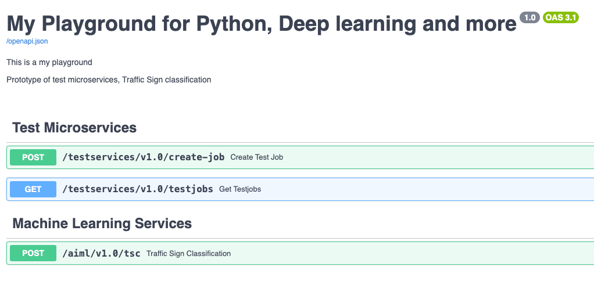
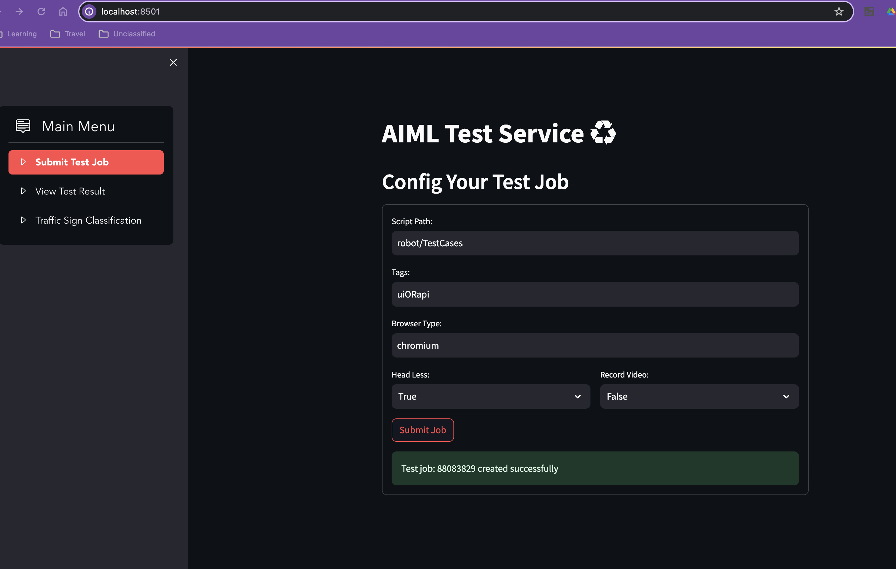
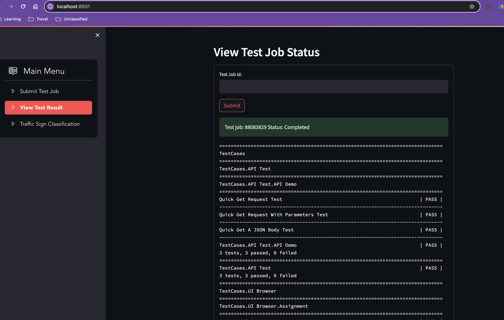
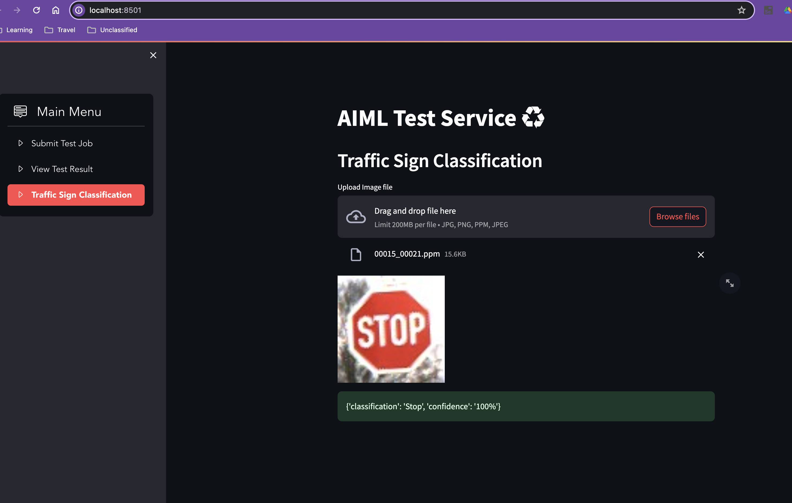

# Welcome to My_playground
my playground for python | machine learning | micro services | test automation

## Overview

This is my play ground to explore some idea about Python and machine learning programing.
At the moment, fastapi microservices implemented for:
- fastapi deployment for machine learning model of traffic sign classification
- prototype of test services for API and web UI application
- a simple web ui application to trigger test run and view test result.
- a simple web ui for traffic sign image classification

## Get Started
- pre-requisite: Python3.10, nodejs
- git check out code
- in project root directory : ~/my_plsyground/
- run command: 
```sh
  pip install -r requirements.txt
````
- run command: 
```sh
  rfbrowser init
````
- start service with command: 
```sh 
  uvicorn app.main:app --host 127.0.0.1 --port 8000
```
- open up service swagger document in browser: http://127.0.0.1:8000/docs

### Alternatively, start the microservices from docker container:

- in project root directory, build docker image
```sh
  docker build .
```
- docker run image with volume and port mapping, sample command below
```shell
docker run -v {local directory paty}:/home/code/robot/Reports -p 8000:8000 -it {image id}
```
- then inside the container command line, run
```shell
    uvicorn app.main:app --host 0.0.0.0 --port 8000
```
- start the web ui application
```shell
    streamlit run app/ui_demo.py
```
- open up web UI in browser: http://localhost:8501/





## Folder Structure

| Folder name     | Description                                                                                                                       | 
|-----------------|-----------------------------------------------------------------------------------------------------------------------------------|
| app             | fastapi services, include trained ML models                                                                                       | 
| mlai_playground | tensor flow models for training and evaluation. Training data not uploaded for traffic sign model, need to download gtsrb dataset |
| robot           | robot framework for writing api and web ui test cases, robot/Reports contains all the test reports                                |


